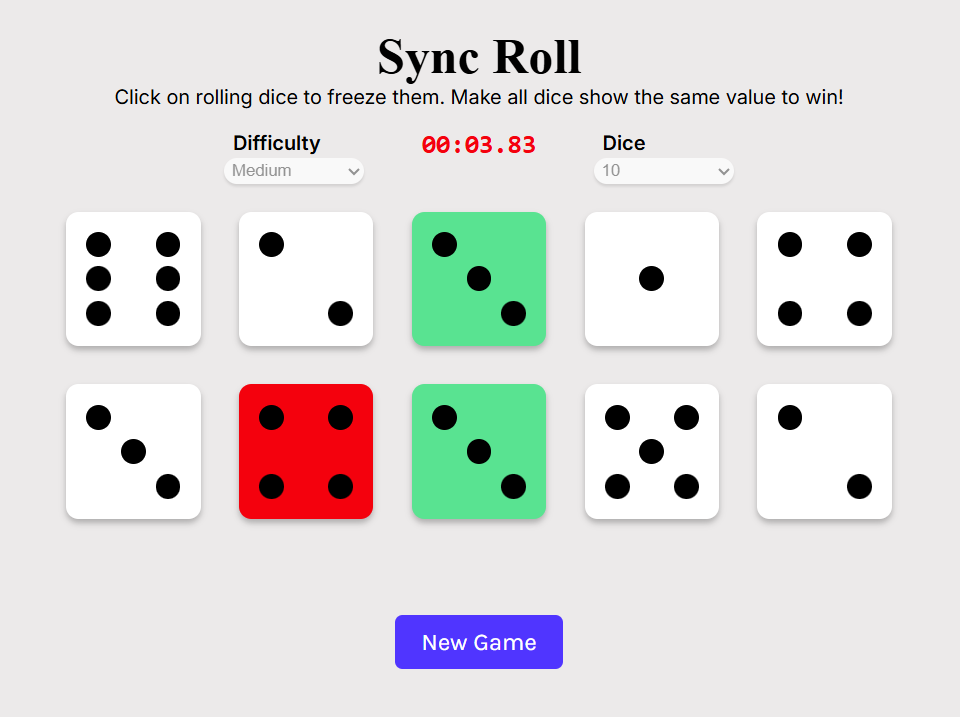

# SyncRoll

**A Dice Synchronization Game Built with React**

<p align="center">
  
</p>

**Live Demo:** https://syncroll2.onrender.com/

---

## About the Game

**SyncRoll** is an interactive dice game where players test their timing and luck.

### Game Rules
- Click **Start** to roll all dice randomly.
- Each die rolls independently.
- Click on a die to **freeze** it.
- Your goal is to **freeze all dice showing the same number**.
- If even **one die stops at a different face**, you lose.
- If all dice match, you win!


## Project Setup Guide

### Install Dependencies

```bash
npm install
```

Run Locally
```bash
npm start
```

Then open:
http://localhost:3000

